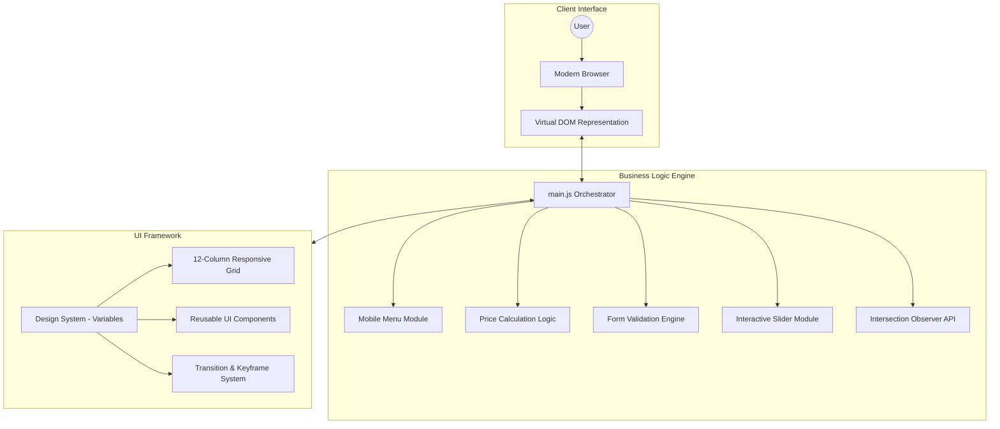
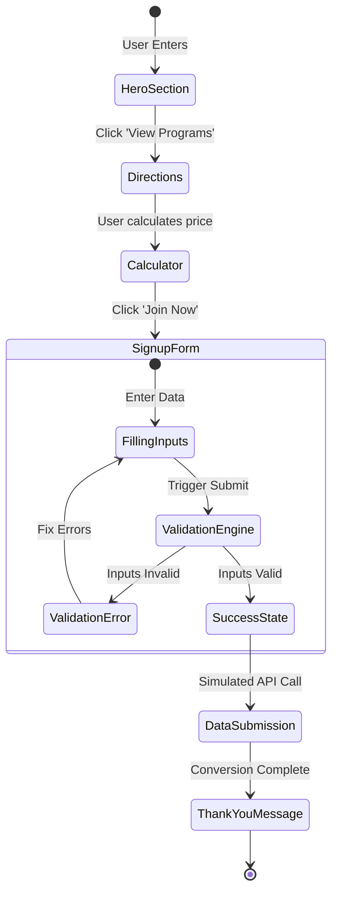
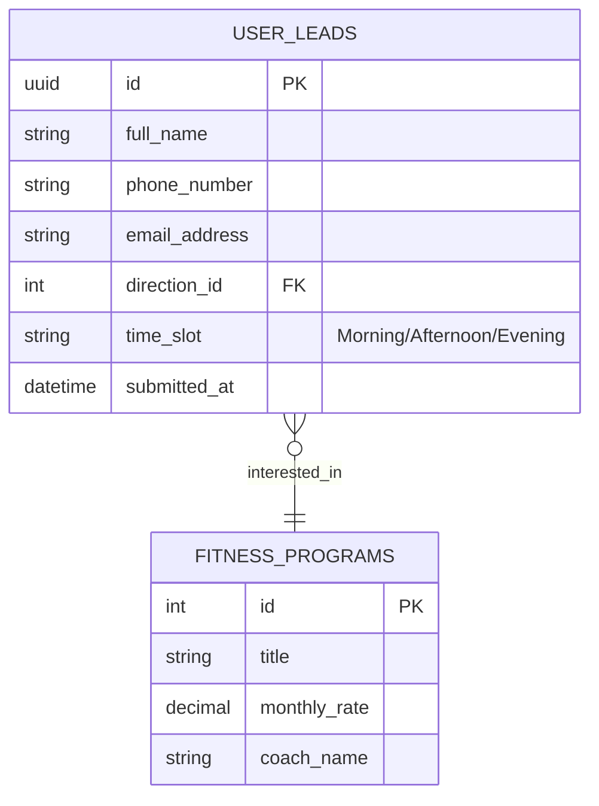
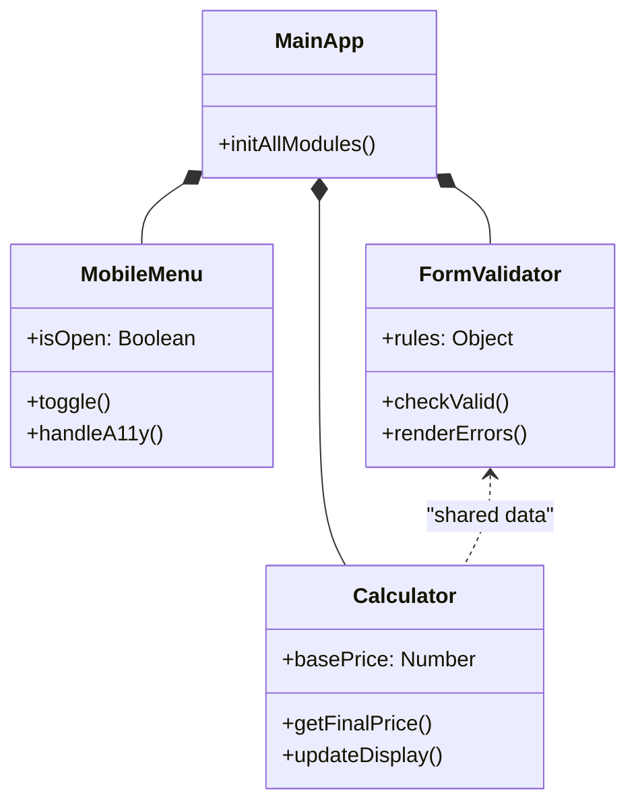

# FitLife | Technical Architecture & System Design

This document outlines the architectural patterns, data flow, and component structure of the FitLife Frontend Platform.

---

## 1. High-Level System Architecture
The project follows a **Modular Monolith** pattern on the frontend, utilizing ES6 modules to encapsulate domain logic and ensure high maintainability.



---

## 2. Professional User Flow
Mapping the journey from initial landing to successful conversion (Lead Generation).



---

## 3. Database Schema (Conceptual ERD)
Designed for scalability, tracking user preferences and program interest.



---

## 4. Component Interaction Diagram
Visualizing the communication between JavaScript modules.



---

## 5. Directory Structure (Senior Standard)
```text
📁 FitLife/
├── 📄 index.html          # Standardized Template
├── 📄 directions.html     # Interactive Services Page
├── 📄 signup.html         # Conversion Oriented Form
├── 📄 ARCHITECT.md        # Technical Blueprints
├── 📄 DOCS.md             # Design System & User Flow
├── 📁 css/
│   └── 🎨 style.css       # Unified Design System
└── 📁 js/
    ├── ⚙️ main.js          # App Bootstrapper
    └── 📁 modules/        # Domain Specific Modules
        ├── 🧩 menu.js      # Navigation Orchestration
        ├── 🧩 calc.js      # Business Math Logic
        ├── 🧩 validator.js # UX Integrity & Validation
        └── 🧩 slider.js    # Carousel & Touch Interaction
```

---

## 6. Technical Specifications

| Spec | Implementation |
| :--- | :--- |
| **Architecture** | Clean Architecture / Modular JS |
| **Styling** | Vanilla CSS with BEM Methodology |
| **Animation** | IntersectionObserver (Performance Optimized) |
| **Accessibility** | ARIA 1.2 Standards Compliant |
| **Validation** | Regex-based with State Management |
| **Responsiveness** | Mobile-First Fluid Grid |

---
*Created for FitLife Project Presentation | Senior Frontend Architect Portfolio*
